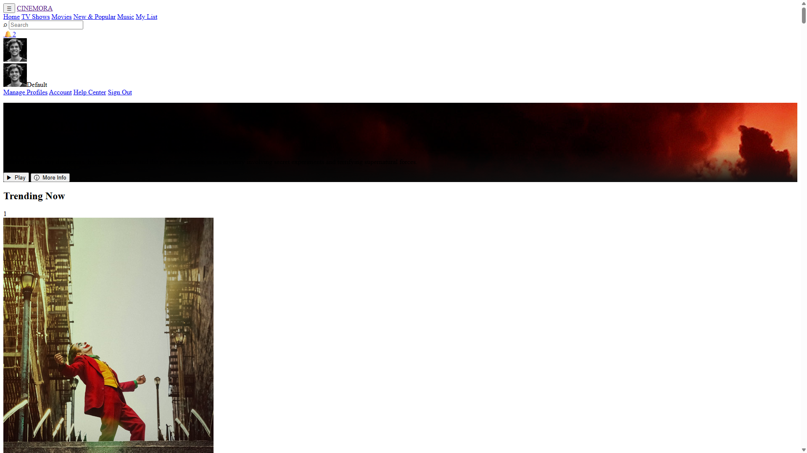
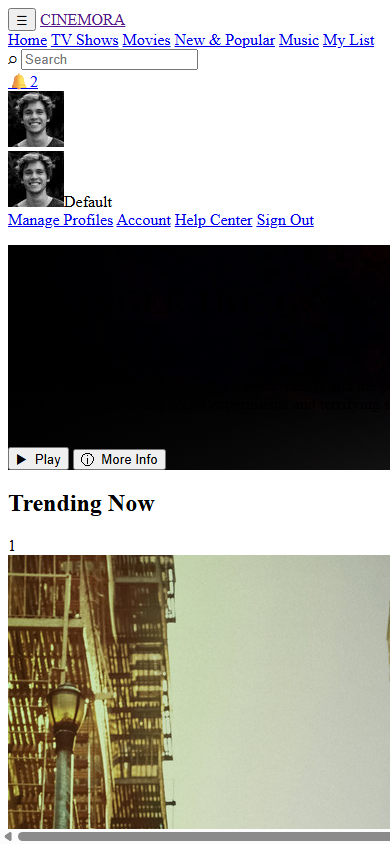
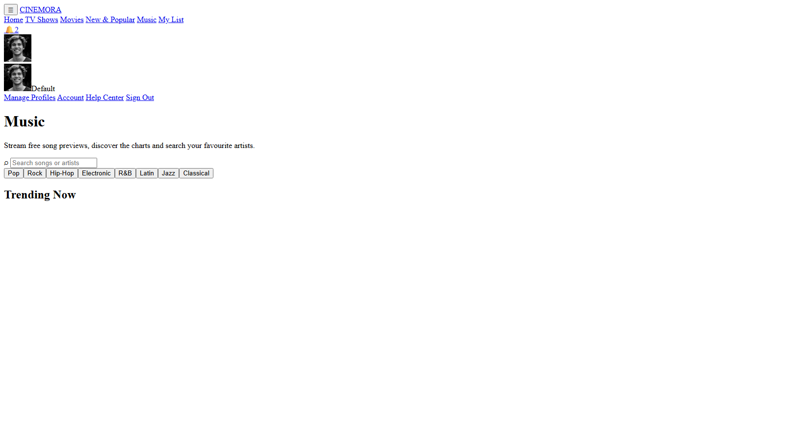
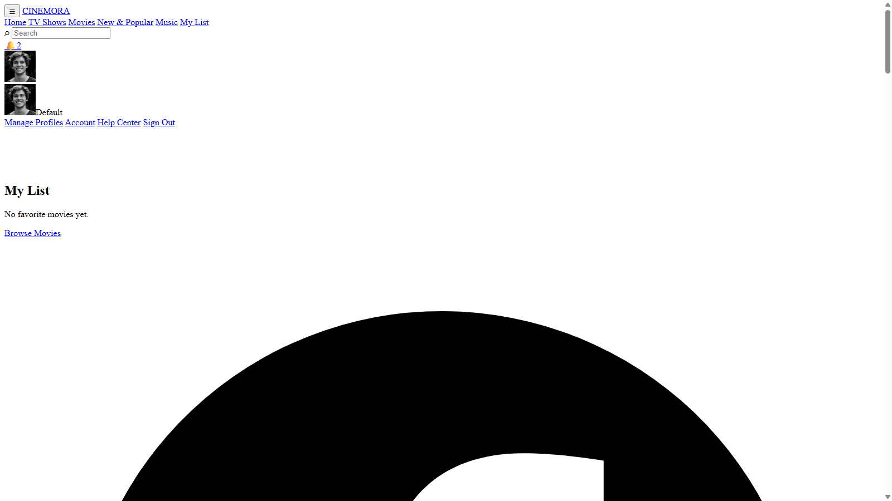

# Reelora

A streaming UI built with plain HTML, CSS, and JavaScript.
No frameworks, no build step, no backend. Everything runs in the browser
and persists locally via localStorage.

Live demo: <https://gabriel-prog254.github.io/Reelora/>



  

---

## Features

- **Browse & search** - Trending, TV Shows, Popular Movies, and free
  public-domain films. Debounced live search with loading skeletons,
  an empty/error state, and instant filters (All / Movies / TV Shows / genre).
- **Continue Watching** - Playback position is saved automatically; cards
  show a progress bar, the Watch button switches to "Resume from mm:ss",
  and the player jumps back to where you left off.
- **My List (favorites)** - Heart any title; your list persists locally
  and renders on its own page.
- **Movie details** - Runtime, genres, cast, rating, trailer embed, and
  comments per title.
- **In-page player** - Fullscreen player with play/pause, seek bar,
  volume, and mute. Streams are resolved from free sources; otherwise a
  graceful "unavailable" screen is shown.
- **Comments & notifications** - Per-movie comment threads and an
  unread-notification counter, all stored locally.
- **Profiles & account** - Manage multiple profiles, avatars, and account
  membership tiers.
- **Music page** - Browse and preview tracks (Deezer public API with an
  offline SoundHelix fallback).
- **Fluid + responsive** - Clamp()-based layouts scale from large
  desktops down to phones; touch-friendly hover fallbacks.
- **Branding** - Site name and copyright are injected at runtime
  (`assets/js/branding.js`) from one config.

## Pages

| Page             | Purpose                                   |
| ---------------- | ----------------------------------------- |
| `index.html`     | Home (redirects to Sign In when logged out): hero, trending ranks, rows, search |
| `pages/Login.html` | Sign In entry screen                   |
| `pages/Sign UP.html` | Create account screen                 |
| `pages/favorites.html` | My List + search                     |
| `pages/music.html`     | Music search and playback             |
| `pages/comments.html`  | Comment threads + free movies         |
| `pages/profiles.html`  | Profile picker                        |
| `pages/notifications.html` | Notifications feed                 |
| `pages/account.html`   | Account & membership                  |

> The app opens on the Sign In page first. Signing in sets a local session
> (`cinemoraSignedIn`); guests hitting any other page are redirected there.

## Run locally

The site is fully static - no server or build step is required. Either:

1. Open `index.html` directly in a browser
   (note: the archive.org fallback has CORS limits over `file://`), or
2. Serve the folder with any static server:

   ```bash
   npx serve .
   # or
   python -m http.server 8080
   ```

## TMDB API key (optional)

Most of the browsing experience works without a key. Add one to unlock
live TMDB search, metadata, ratings, and trailers for millions of titles.

1. Create a free account at <https://www.themoviedb.org/settings/api>
   and request an API key (v3 auth).
2. This repo is git-safe by design: the committed `assets/js/config.js`
   only contains a placeholder. Your real key lives in a **local** file:
   - Create `assets/js/config.local.js` with:

     ```js
     window.TMDB_LOCAL_KEY = "your_real_key_here";
     ```

     (An example file already exists at that path - just fill it in.)
   - The file is ignored by git (see `.gitignore`), so your key never
     reaches GitHub.

3. Reload - the data layer reads `window.TMDB_CONFIG` and will use your key.

> Security note: an API key in a static site is visible in the browser.
> This is normal for client-side apps. Keep the key on the TMDB
> developer/public plan and never commit it.

## How playback works without a paid API

When a movie has no bundled file, the player attempts, in order:

1. A bundled/offline file if one exists,
2. The free **Internet Archive** API (public-domain films, no key needed),
3. Otherwise it shows a friendly unavailable message.

The browse rows still render using the bundled `assets/js/movies.js`
catalog, so the app is fully usable offline.

## Storage keys

Per-browser persistence is handled through localStorage:

| Key                  | Purpose                          |
| -------------------- | -------------------------------- |
| `reeloraFavs`        | My List (favorites)              |
| `reeloraProgress`    | Continue Watching positions      |
| `cinemoraComments`   | Comment threads                  |
| `cinemoraNotifs`     | Notifications                    |
| `cinemoraProfiles`   | Profile list                     |
| `cinemoraProfile`    | Active profile                   |
| `cinemoraSignedIn`   | Session flag                     |
| `cinemoraSession`    | Active session (name + email)    |
| `cinemoraAccounts`   | Created accounts                 |

## Project structure

```
assets/
  css/style.css        Global styles (fluid layout, cards, player, search)
  js/
    config.js          Brand + TMDB config (placeholder key)
    config.local.js    LOCAL ONLY - your real TMDB key (gitignored)
    api.js             TMDB data layer (cache, search, details, trailers)
    archive.js         Internet Archive fallback layer
    movies.js          Bundled offline movie catalog
    favorites.js       My List storage layer (window.MyList)
    continue.js        Continue Watching storage layer (window.ContinueWatching)
    main.js            Home/favorites logic: cards, modal, player, search
    music.js           Music browsing & playback
    comments.js        Comments
    profiles.js        Profile picker
    profile.js         Session/profile/notifications helpers (all pages)
    notifications.js   Notifications feed
    account.js         Account settings
```

## Deploy

The site is a static folder - deploy it anywhere static files are served.

### GitHub Pages (already set up for this repo)

1. The repository already has GitHub Pages enabled (branch `main`).
2. Push to `main` and Pages re-deploys automatically:

   ```bash
   git add .
   git commit -m "Update site"
   git push origin main
   ```

3. The app is published at
   <https://gabriel-prog254.github.io/Reelora/>.

### Netlify / Vercel (alternative)

- Netlify: drag-and-drop the project folder at <https://app.netlify.com>,
  or "Add new site" -> "Import from Git".
- Vercel: <https://vercel.com/new> -> import the repo. No build command
  or output directory is needed (leave the defaults).

## License / credits

- Data and artwork belong to their respective owners (TMDB, Internet
  Archive, Deezer, and film studios). This is a student project for
  educational purposes only.
- Logos, avatars, and public images are used for demo purposes.